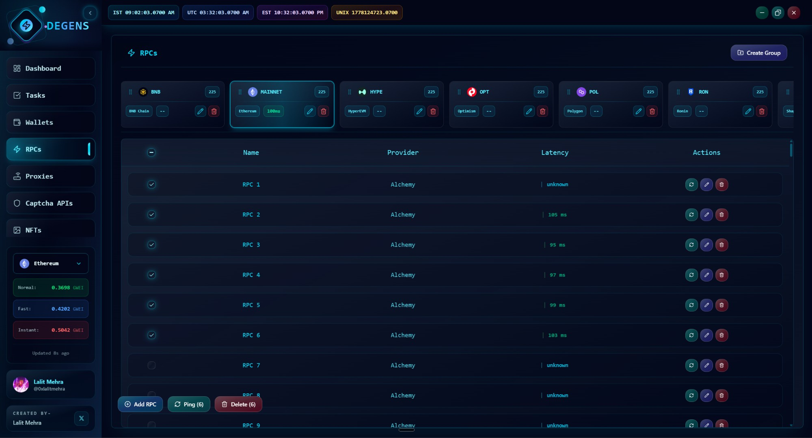

# RPCs

RPCs are the URLs your wallets and tasks talk to. Every balance check, every gas estimate, every transaction broadcast goes through one. The RPCs page is where you manage them, ping them, and prune the slow ones.

* RPCs live inside **groups**.
* Each group is **tied to one EVM chain ID** (e.g., 1 = Ethereum, 42161 = Arbitrum, 8453 = Base).
* Each group can hold up to **500 endpoints**.
* When a task runs, it picks an RPC from its assigned group — typically rotating to spread load and dodge rate limits.


**The RPCs page is EVM-only.** Solana, Sui, Aptos, and Bitcoin use built-in defaults from the chain SDKs and don't surface here.


## Adding RPCs

Click **Add RPC** in the bottom toolbar. You'll see a textarea — paste URLs in any of these formats, one per line:

<figure><figcaption></figcaption></figure>

* Bare URL → name auto-derived from the hostname.
* `name,URL` → custom name.
* Duplicates (case-insensitive URL match) are skipped.

You can also import from a `.txt` file with the file-picker.

## Pinging RPCs

The RPC table shows each endpoint's **latency (ms)** and **status** (online / offline / unknown). After you add a batch, you'll want to ping them.

* **Single RPC** — ping icon on the row.
* **Selected RPCs** — tick checkboxes, then **Ping (N)** in the toolbar.

The ping runs in two phases:

1. **Fast sweep** — 3-second timeout. Catches the obviously-good ones quickly.
2. **Refine pass** — 8-second timeout, only on whatever came back as "unknown". Gives slow-but-working ones a fairer shot.

While the ping is running, the row's status pulses. After it finishes, you'll see green for online with a latency number, red for offline, or gray for unknown.


**Latency is round-trip ping, not gas-bid speed.** A 50ms RPC isn't always faster at landing transactions than a 200ms one — geography, rate limits, and validator peering matter. Use latency as a filter, not gospel.


## Chain validation

When you ping, the app also **checks that the RPC is actually serving the chain you expect** (using `eth_chainId`). If you accidentally added a Polygon RPC to your Ethereum group, the ping will mark it offline and show a chain-mismatch hint in the row.

## Groups and chains

Click **Create Group** at the top of the page. Pick:

* **Group name** — anything you want.
* **Chain ID** — one EVM chain. This is locked once set; you can't move RPCs between chain IDs.

The group strip across the top lets you switch between groups. Each group's chain is shown in the tab. You can rename or delete groups from the tab actions.

## Editing an RPC

Click the edit icon on a row to open the edit modal. You can:

* Rename it.
* Replace the URL.
* Copy the URL to clipboard.

## Bulk operations

* **Ping (N)** — re-test selected.
* **Delete (N)** — bulk delete with confirmation.
* The  mask toggle in the header redacts URLs to `*****` so you can share screenshots without leaking your private RPC keys.

## Practical tips

* **Mix providers.** A group with Alchemy + Infura + Ankr + a public node is more resilient than 5 endpoints from the same vendor.
* **Add private RPCs, not free tier.** Public free RPCs rate-limit hard during a hyped mint. If you can afford an Alchemy or QuickNode key, the mint loss saved on the first failed attempt usually pays for the month.
* **Re-ping before big drops.** Endpoints go down. A two-minute ping pass right before a mint window catches problems you'd otherwise hit live.
* **For Base / Optimism / Arbitrum**, Alchemy and the chain's official RPC tend to be the most reliable; public RPCs are usually congested.

***

Next: [Proxies](proxies.md).
