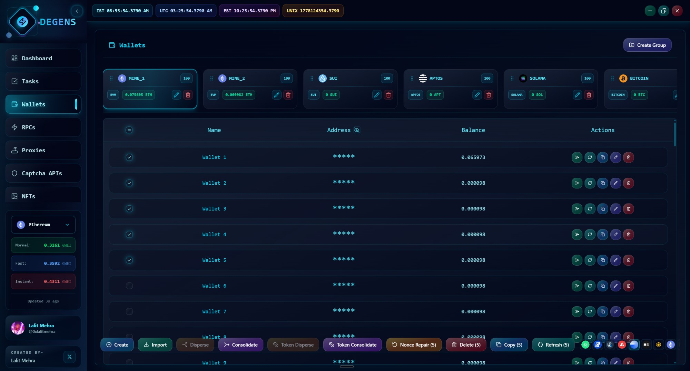
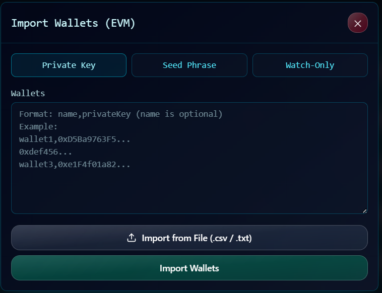

# Wallets

Wallets are the foundation. Every task, every WL check, every balance refresh runs against a wallet. The Wallets page is where you organize them.

## Mental model

* Wallets live inside **groups**.
* Each group is **tied to one chain family** (EVM, Solana, Bitcoin, Sui, or Aptos).
* Each group can hold up to **1,000 wallets**.
* Wallets store an **encrypted private key** (or no key at all if it's watch-only) and an address.

You'll typically have a few groups per chain — e.g., "EVM Main", "EVM Burners", "Solana", "Sui Test" — and pick a group when you're queueing a task.

## Adding wallets

Two paths from the bottom toolbar:

### Generate new

Click **Create**. Pick how many wallets to generate (per chain, in the chain's native format). The app generates them client-side, encrypts the keys, and saves them into the active group. You'll see them appear in the table.

For Sui, the create flow has a couple of extra steps because of how its key derivation works.

### Import existing

Click **Import**. You'll see a tabbed dialog with three import modes:

| Mode | Format | Notes |
|---|---|---|
| **Private Key** | One key per line, or `name,privatekey` per line | EVM, Solana, Bitcoin, Aptos, Sui all supported |
| **Seed Phrase** | Mnemonic + optional passphrase | EVM and Sui — derives the first N accounts |
| **Address only** | Just an address | Watch-only — useful for tracking, can't sign txs |

You can also click the file-picker to import from a `.txt` or `.csv` instead of pasting.

Duplicates within the group are skipped automatically — you'll see a toast saying how many were imported and how many were duplicates.

## Wallet groups

The horizontal strip at the top of the page is your group switcher. Each tab is a group; the icon shows which chain it's tied to.

* **Create group** — top-right button. Pick a chain family, give it a name.
* **Rename group** — pencil icon on the active group's tab.
* **Delete group** — trash icon on the active group's tab. **Deletes all wallets in the group too**, so back up first if you need to.
* **Reorder groups** — drag the tabs sideways. The order is saved.

## The wallet table

Each row shows:

| Column | What it is |
|---|---|
| ☑ | Selection checkbox |
| Name | Auto-generated ("Wallet 1") or imported name |
| Address | Click to copy. The header has a 👁️ toggle that masks all addresses to `*****` for screen-sharing safety. |
| Balance | Native token balance for this wallet. For EVM groups, the balance reflects whichever chain you've picked in the bottom RPC selector. |
| Actions | Refresh, edit, delete |

## Refreshing balances

* **Single wallet** — refresh icon on the row.
* **Selected wallets** — tick the checkboxes, then click **Refresh (N)** in the bottom toolbar. Runs in parallel.
* **EVM-specific:** The bottom toolbar has a chain dropdown. Whatever you pick there is the chain balances are read from. Switching it reruns the fetches.

If a balance comes back as `—` or 0 unexpectedly, check your RPC group health under [RPCs](rpcs.md) — a dead RPC will silently fail the refresh.

## Bulk operations

Selecting one or more wallets activates the bottom toolbar:

* **Copy (N)** — copies the addresses to your clipboard, newline-separated.
* **Refresh (N)** — refresh balances for selected.
* **Delete (N)** — bulk delete with a confirmation modal.
* **Consolidate** — pick 2+ wallets to gather their balances into one destination. Native token only.
* **Disperse** — pick exactly 1 source wallet to send out to many recipients.
* **Token consolidate / disperse** — same flow but for SPL / Aptos / Sui tokens (Solana, Aptos, Sui groups only).
* **Reset Nonce** *(EVM only)* — kicks any wallet whose local nonce got out of sync; cancels stuck pending txs by re-broadcasting them with `0` value to self at higher gas. Use this if a task is hanging on `pending` and you can't figure out why.

## Editing a wallet

Double-click a row (or the edit icon) to open the edit modal. You can rename, view the masked private key, copy it to the clipboard, or change watch-only status. The full key is only revealed when you explicitly click the show button.

## Where the keys actually live

* All keys are stored **encrypted on your disk**, in the app's local data folder.
* The data folder lives in your user profile (`%APPDATA%\com.degens\` on Windows, `~/Library/Application Support/com.degens/` on macOS).
* **There is no cloud sync.** The keys never leave your machine.
* Watch-only wallets store only the address — no key material.

> **Backups are your job.** If the data folder gets deleted or corrupted, your wallets are gone unless you have the original seed phrases / private keys somewhere safe. The Settings page has an [Export Data](../settings/settings.md#export-data) section that can dump wallets to CSV if you want a portable backup. Treat that file like cash.

## Chains supported

| Chain family | Generate | Import (PK) | Import (Seed) | Watch-only |
|---|---|---|---|---|
| **EVM** (all chains) | ✅ | ✅ | ✅ | ✅ |
| **Solana** | ✅ | ✅ | — | ✅ |
| **Bitcoin** | ✅ | ✅ | — | ✅ |
| **Sui** | ✅ | ✅ | ✅ | ✅ |
| **Aptos** | ✅ | ✅ | — | ✅ |

EVM groups cover every EVM chain (Ethereum, Arbitrum, Base, Polygon, etc.) — the chain is a per-task setting, not per-group. The other chains are 1 group = 1 chain.

---

Wallets need RPCs to read state. Next: [RPCs](rpcs.md).
