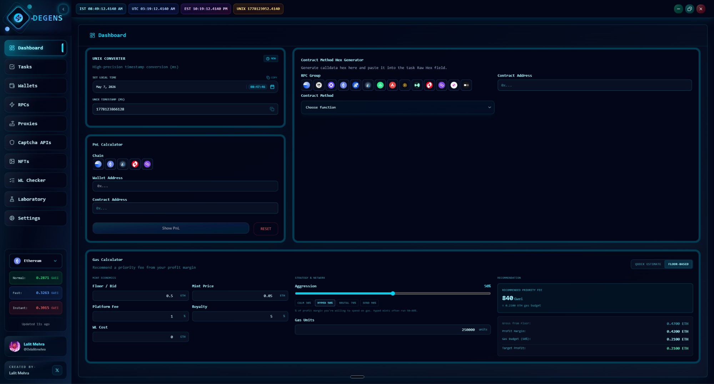

# Dashboard

The Dashboard is your home base — quick utilities you reach for during drop prep without breaking flow. It's a bento-style grid of small tools, each useful on its own.

## What's on it

| Widget | What it does |
|---|---|
| **Gas Calculator** | Estimate mint cost or compute a recommended priority fee from a floor price |
| **Contract Hex Generator** | Build raw `data:` payloads for any function on any verified contract |
| **PnL Calculator** | Quick profit/loss math for hypothetical sells |
| **Unix Converter** | Unix timestamp ↔ human-readable date, in your local TZ and UTC |

The sidebar also shows a live **Ethereum Gas Tracker** with three cards (Normal / Fast / Instant) — that's not strictly part of the Dashboard page, but it's always visible.

## Gas Calculator

The Gas Calculator is the biggest widget on the page and has two modes. Toggle between them at the top of the card.

### Quick Estimate mode

For when you know what you want to bid and just need to see the math.

Inputs:
* **Mint Price (ETH)**
* **Gas Limit** (units, e.g., 250,000)
* **Max Gas Fee (Gwei)** — your max base + priority bid
* **Max Priority Fee (Gwei)** — must be ≤ Max Gas Fee

Outputs (live):
* **Min Total** — mint price + gas at base fee
* **Max Total** — mint price + gas at full max fee
* **Min Gas Cost / Max Gas Cost** — gas-only ranges in ETH

If your priority fee exceeds your max fee, the field highlights red and the math freezes. Fix it and the numbers come back.

### Floor-Based mode

This is the one you'll actually use during a hyped drop. It computes a **recommended priority fee** based on the post-mint floor price and how aggressive you want to be.

Left section — **Mint Economics:**
* **Floor / Bid (ETH)** — what you expect the NFT to fetch right after mint
* **Mint Price (ETH)**
* **Platform Fee (%)** — e.g., 2.5% for OpenSea
* **Royalty (%)** — creator royalties
* **WL Cost (ETH)** — if there's a WL spot fee separate from mint price

Middle section — **Strategy & Network:**
* **Aggression slider** (0–100%). Presets:
  * **Calm** — 30%
  * **Hyped** — 50%
  * **Brutal** — 70%
  * **Send** — 90%

Aggression is the **% of profit margin you're willing to spend on gas**. "Send 90%" means you're keeping 10% margin and throwing the rest at gas to land the tx. Hyped mints typically run 50–80%.

Right section — **Recommendation:**
* The big number: **Recommended Priority Fee (Gwei)**
* Below it: gross from floor, profit margin, gas budget, target profit

If your margin is non-positive (you'd lose money even at zero gas), the box turns red and tells you flatly. Don't mint that.

## Contract Hex Generator

For when you need to construct a transaction payload by hand — usually for the **Custom** task platform, or to debug a contract call.

Workflow:
1. Paste the **contract address**.
2. The app pulls the verified ABI from Etherscan (you'll need an API key — see [Settings → API Keys](../settings/settings.md#api-keys)).
3. Pick a function from the dropdown.
4. Fill in the parameters.
5. Optionally simulate against the **Simulation Wallet Address** in Settings (so the call sees the right balances).
6. Copy the resulting hex.

Paste that hex into a Custom task's payload field, or use it to verify what a tool you don't trust is actually about to send.


If the contract isn't verified on Etherscan, the ABI fetch fails and you'll need to paste the ABI manually (or use a different contract).


## PnL Calculator

Plug in:
* **Cost basis** — what you paid total (mint + gas)
* **Sell price**
* **Platform fee %**
* **Royalty %**

Output: net profit/loss after fees. Useful for sanity-checking "should I list at 0.05 or hold for 0.08?"

## Unix Converter

Two-way:
* Paste a Unix timestamp → see the date in your local TZ + UTC.
* Pick a date → get the Unix timestamp.

Drops announce in UTC half the time and local TZ the other half. This widget reconciles them. Also useful when you set scheduled tasks — the [Tasks](tasks.md) page wants a Unix timestamp.

---

The Dashboard is utilities. The actual work happens elsewhere. Next: [Whitelist Checker](whitelist-checker.md).
