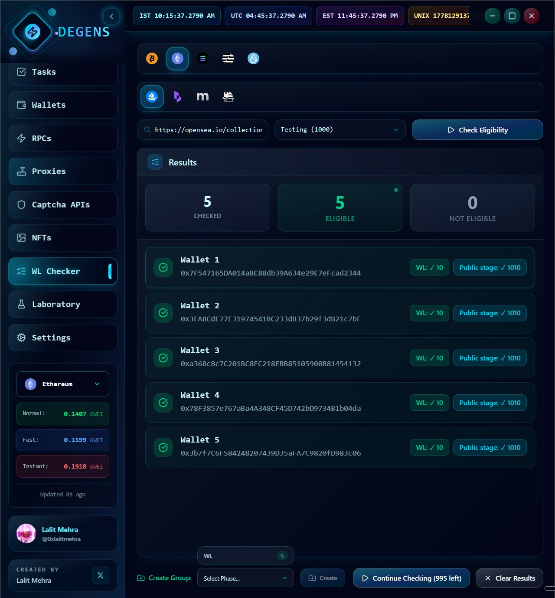

# Whitelist Checker

The WL Checker bulk-tests your wallets against a drop's eligibility endpoints. Paste a URL, pick a wallet group, hit go — get a per-wallet table of which phases each wallet qualifies for.

## Supported platforms

The built-in checker supports **EVM** drops on:

* **OpenSea**
* **Mintify**
* **Scatter**
* **Blever**

> **Why not Element / HyperLaunch / Manifold?** Those platforms either require complex per-platform auth (sign-in flows the checker can't replicate cheaply) or expose phase data through endpoints that change too often to baseline. The minting side of [Tasks](tasks.md) supports them; the checker doesn't (yet).

For everything else (custom platforms, new launches), use the [Laboratory](laboratory.md) — manifests with a `phaseList` eligibility section show up in this picker too.

## Running a check

1. **Pick a wallet type** at the top — EVM, Solana, Aptos, Sui, or Bitcoin. (For built-in platforms, EVM is the only one that has live checkers; the others are reserved for Lab platforms.) The wallet group dropdown filters to groups matching the selected type.
2. **Pick a platform** in the row below. If you paste a URL that matches a known platform's domain (e.g., `opensea.io/...`), the platform tab auto-switches.
3. **Paste the collection slug or URL** in the input. Pasted URLs are parsed into the right slug automatically.
4. **Pick a wallet group** from the dropdown — this is the group of wallets that'll be checked.
5. Click **Check Eligibility**.

While running, you'll see a progress counter ("Checking 7/35") and can:
* **Pause** — stops at the current wallet; the rest stay queued.
* **Resume** — picks up where you left off.
* **Stop** — abandons the run; what's been checked is kept.

Each wallet is processed sequentially with a 50ms gap between them to keep platforms calm. If a 429 (rate limited) comes back, the checker retries up to 3 times with exponential backoff.

## Reading the results

At the top of the results panel:

* **Total checked** — how many wallets the run hit
* **Eligible** — how many qualified for at least one non-public phase
* **Not eligible** — the rest

Below that, a per-wallet row shows:

* **Wallet name and address**
* **Phase badges** — one per phase the platform exposes. Each badge shows:
  * Phase name (e.g., "Public", "Allowlist", "Phase 1")
  * Eligibility ( / )
  * Per-phase max mint per wallet, if known

A wallet that's eligible **for any non-public phase** is highlighted as a "WL hit". Wallets that are only eligible for the public sale aren't usually worth bulk-grouping — everyone is eligible for public.

> **Results live in memory only.** Reload the page (or quit the app) and they're gone. There's no export button — copy what you need before you leave.

## Spawning a new wallet group from eligible wallets

This is the magic move. After a run completes:

1. A footer appears below the results.
2. Pick a phase from the dropdown.
3. Click **Create**.

The app builds a new wallet group containing **only the wallets eligible for that phase**, named after the platform + phase, in the same chain family as the original group.

Now you can flip to [Tasks](tasks.md), pick that new group, and build a task targeting exactly the right wallets. No copy-pasting addresses. No "wait, was wallet 23 on the list?"

This is by far the highest-leverage feature in the app. A group with 200 wallets becomes a 12-wallet WL group in two clicks.

## Tips

* **Run the check well before the drop.** Don't try this 30 seconds before mint — the platform's eligibility endpoints can lag behind their UI by a minute or two during high traffic.
* **Re-run if eligibility was just published.** Some platforms publish WL updates in waves. If your first run shows 5/200 eligible and you expected more, refresh and try again in 5 minutes.
* **Watch the rate limits.** Running thousands of wallets at once will eventually hit the platform's rate limit. The checker handles 429s gracefully but you may want to break large groups into smaller chunks.
* **Use a proxy group** for very large checks. The checker uses the same proxy infrastructure as tasks — set up a clean proxy group ahead of time.

---

Once you know which wallets are eligible, run them. Next: [Tasks](tasks.md).
