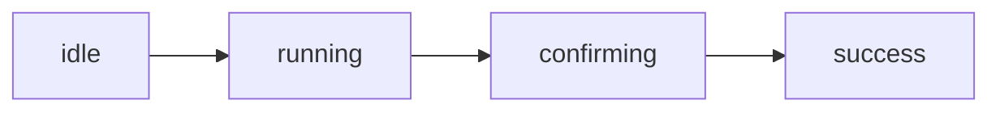

# Quickstart

You want to mint something. Here's the fastest path from zero to a successful first mint — about 5 minutes if you've already got the app installed and a wallet funded.


**Test with a throwaway wallet first.** Don't use your main vault for your first run. Mistakes with private keys are forever. Move winnings to cold storage afterward via the [NFTs page](../features/nfts.md).


## 1. Install and log in

Install the app from the Discord channel ([full guide](installation.md)), launch it, click **Login with Discord**, approve the consent. You'll land on the Dashboard. *Total time: ~1 minute.*

## 2. Add a wallet

Sidebar → **Wallets** → **+ Create Group** → name it "Test", chain family **EVM** → save.

Then in the bottom toolbar → **Import** → paste a private key (use a throwaway funded with ~0.02 ETH on whatever chain your target drop is on, e.g. Base or Ethereum) → **Import Wallets**.

You should see your wallet appear with a balance. If the balance shows `—` or `0` and you know it should be funded, see step 3 (your RPC isn't set yet).

## 3. Add an RPC group

Sidebar → **RPCs** → **+ Create Group** → name it after the chain (e.g., "Base"), pick chain ID **8453** (Base) or **1** (Ethereum) → save.

Then **Add RPC** → paste 1–2 URLs:
* For Base: `https://mainnet.base.org` (public, fine for testing)
* For Ethereum: a paid Alchemy/Infura/QuickNode key. Public RPCs throttle hard during real drops.

Click **Ping** to verify it's reachable. Green means you're good.

Now go back to **Wallets**, pick your wallet group, and pick the new RPC group from the bottom dropdown. Balances should populate.

## 4. Run a one-wallet test mint

Sidebar → **Tasks** → **+ New Group** → pick a chain family (**EVM**) and a platform. **OpenSea** is a good first test because it auto-fetches the contract from a slug.

Click **+ Create Task**. Fill in:

* **Wallets:** select just your one test wallet.
* **RPC group:** the one you set up in step 3.
* **Contract:** paste an OpenSea drop URL or slug.
* The **Mint Phase** card will populate after a moment — click the active phase to auto-fill price and timestamp.
* **Quantity:** 1.
* **Gas:** leave on **Auto** for the first run.

Click **Create Task**.

## 5. Run it

Click the run icon on the task row. Watch the status badge:

If it goes green, you've minted your first NFT. Check the wallet's balance to confirm it dropped.

If it goes **red (Failed)**, click the row's error chip to see the reason — and head to [Troubleshooting → Tasks](../help/troubleshooting.md#tasks) for common causes.


**Worked first try?** Now scale up. Stage 5–10 wallets in the same group, queue tasks, and run them in batch. See [Tasks → Batch mode](../features/tasks.md#batch-mode) for landing-rate tips when you're hitting a contended drop.


## What to read next

| If you want to... | Go to |
|---|---|
| Understand how wallets, RPCs, proxies fit together | [Core Concepts](../core-concepts/wallets.md) |
| Bulk-check eligibility before queueing tasks | [Whitelist Checker](../features/whitelist-checker.md) |
| Mint at scale with proxies + captcha | [Tasks](../features/tasks.md), [Proxies](../core-concepts/proxies.md), [Captcha](../core-concepts/captcha.md) |
| Add a custom platform yourself | [Laboratory](../features/laboratory.md) |
| Save settings, back up wallets | [Settings](../settings/settings.md) |

---

Stuck at any step? [FAQ](../help/faq.md) covers the basics. [Troubleshooting](../help/troubleshooting.md) covers when things break.
