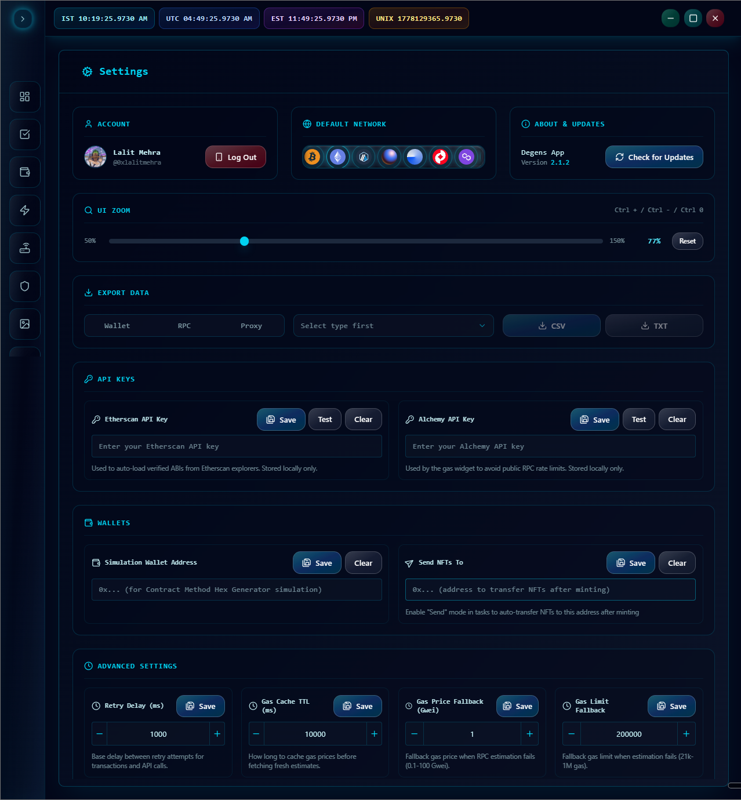

# Settings

Settings is a single scrollable page broken into sections. Open it from the sidebar (gear icon at the bottom).

## Overview

Three cards at the top:

### Account

* **Avatar + display name** — pulled from Discord.
* **Log Out** — signs you out and clears the device binding. The next login on this machine will bind fresh. See [First Launch & Login](../getting-started/first-launch.md) for what device binding does.

### Default Network

A dropdown of EVM mainnets and L2s (Ethereum, Arbitrum, Optimism, Base, Polygon, etc.). The selection is the app-wide default for things like the Dashboard's Gas Calculator and balance widgets.

### About & Updates

* **App version** — what you're running.
* **Check for Updates** — manually triggers an update check. Opens the [Update modal](updates.md). Useful if you skipped a recent update or want to confirm you're on latest.

## UI Zoom

A slider from 50% to 150% in 1% increments. Use the keyboard for finer control:

* `Ctrl` + `+` — zoom in
* `Ctrl` + `-` — zoom out
* `Ctrl` + `0` — reset to 100%

A **Reset** button is grayed out when you're already at 100%.

The zoom is per-machine — it's saved locally and re-applied on launch.

## Export Data

Three-step batch export:

1. **Type** — toggle: Wallet, RPC, or Proxy.
2. **Group** — dropdown of groups for the chosen type.
3. **CSV** or **TXT** — exports to a file. The system save dialog lets you pick where.

Use this for backups (especially Wallets — the only way to get your wallet data out of the app's encrypted DB into a portable file). **Treat exported wallet files like cash:**

* Save them to encrypted storage (KeePass, 1Password file attachment, an encrypted USB).
* Don't email them to yourself. Don't upload them to Drive/Dropbox in the clear.
* Delete them from your downloads folder once they're somewhere safe.

## API Keys

Two cards.

### Etherscan API Key

* **What it's for:** auto-loading verified contract ABIs in the [Contract Hex Generator](../features/dashboard.md#contract-hex-generator) and elsewhere.
* **Buttons:** Save, Test, Clear.
* **Test** tries to fetch a known mainnet ABI (Disperse contract). Toast tells you pass/fail.

### Alchemy API Key

* **What it's for:** the sidebar's live gas tracker, to avoid public-RPC rate limits.
* **Buttons:** Save, Test, Clear.
* **Test** runs a quick `getBlockNumber` call against Alchemy. Toast tells you pass/fail.

> **Both keys are stored locally only.** The app never proxies them through any server. They're used directly from your machine to Etherscan / Alchemy.

## Wallet Settings

Two utility addresses, both EVM:

### Simulation Wallet Address

When you simulate a contract call from the [Contract Hex Generator](../features/dashboard.md#contract-hex-generator), the simulation runs as if it were sent from this address. Useful so balance/allowance reads reflect a real wallet's state, not zero-state.

### Send NFTs To

Destination address for the **Send mode** in tasks. When a task succeeds and Send mode is on, the minted NFT is auto-transferred to this address. Useful when you want everything funneled to a vault wallet immediately after mint, without a separate consolidation step.

Both fields validate as 40-character hex addresses. Save when ready, Clear to remove.

## Advanced Settings

Four numeric stepper cards. The defaults are sensible — only touch these if you know what you're doing.

### Retry Delay (ms)

Base delay between retry attempts for failed transactions and API calls. Snaps to 50ms increments. Default is fine for most networks; bump it up if you're getting rate-limited.

### Gas Cache TTL (ms)

How long the gas tracker caches a fetched gas price before re-querying. Higher = fewer RPC calls but staler data. Lower = fresher prices but more RPC load. Snaps to 100ms increments.

### Gas Price Fallback (Gwei)

If gas estimation fails (RPC down or rate-limited), the engine uses this as a fallback. Set it to something safe for your most-used chain.

### Gas Limit Fallback

Same idea, but for gas limit. The engine tries to estimate from the contract; this kicks in if estimation fails. Default works for most ERC-721 mints; raise it for unusually heavy contracts (e.g., complex Manifold claims).

Each card has +/- buttons, an input field with live validation, and a **Save** button. Each saves independently.

---

Next: [Updates](updates.md).
